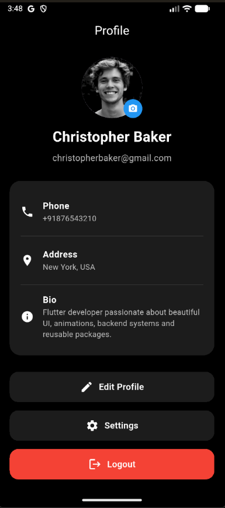
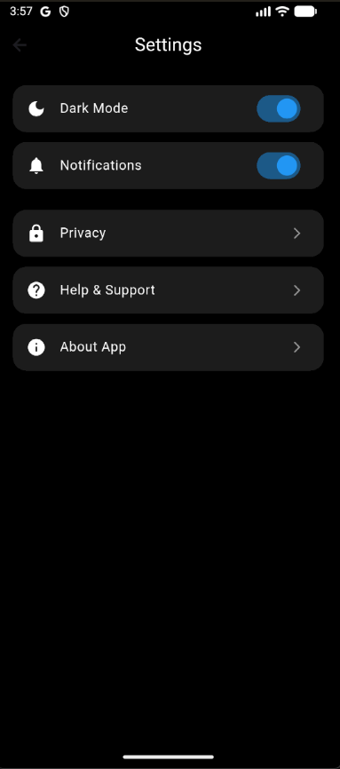

# Profile Lift

A beautiful, customizable Flutter profile UI package with editable profile, settings screen, image picker, light/dark theme support, and smooth animations.

## Features

- Modern profile screen
- Editable profile fields
- Profile image picker
- Live image preview
- Settings screen
- Light and dark theme support
- Custom theme colors
- Logout callback support
- Smooth fade and slide animation
- Backend-ready callbacks

## Screenshots

<p>
  
  &nbsp;&nbsp;&nbsp;
  
</p>

## Installation

Add this to your `pubspec.yaml`:

```yaml
dependencies:
  profile_lift: ^0.0.1
```

## Usage

```dart
ProfileLiftScreen(
  editable: true,
  profile: const ProfileLiftModel(
    name: "Christopher Baker",
    email: "christopherbaker@gmail.com",
    phone: "+1 9876543210",
    address: "New York, USA",
    bio: "Flutter developer passionate about beautiful UI.",
    imageUrl: "https://i.pravatar.cc/300?img=12",
  ),
  onSaveProfile: (updatedProfile) {
    // Save to Firebase, API, SQLite, etc.
  },
  onSettings: () {
    // Open settings screen
  },
  onLogout: () {
    // Logout logic
  },
)
```

## Settings Screen

```dart
ProfileLiftSettings(
  darkMode: true,
  notifications: true,
  onDarkModeChanged: (value) {},
  onNotificationsChanged: (value) {},
)
```

## Custom Theme

```dart
ProfileLiftScreen(
  theme: const ProfileLiftTheme(
    backgroundColor: Colors.black,
    cardColor: Color(0xff1b1b1b),
    textColor: Colors.white,
    subtitleColor: Colors.white70,
    primaryColor: Colors.blue,
    logoutColor: Colors.red,
  ),
  profile: profile,
)
```

## Contributing

Contributions are welcome.
Feel free to open issues and pull requests.

## License

MIT License

## GitHub

GitHub Repository:
https://github.com/Sakshi-2508/profile_lift